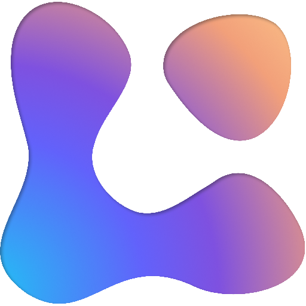
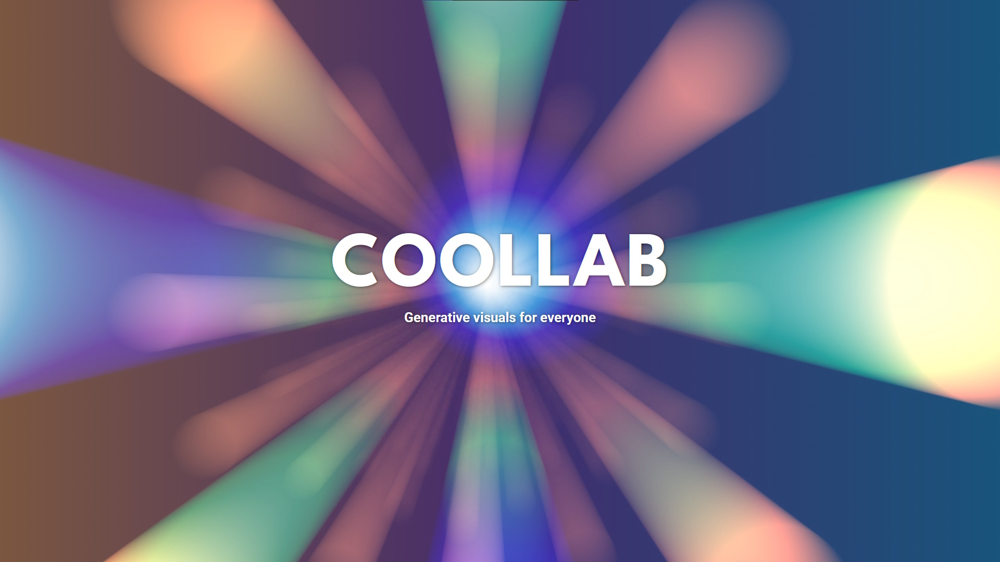
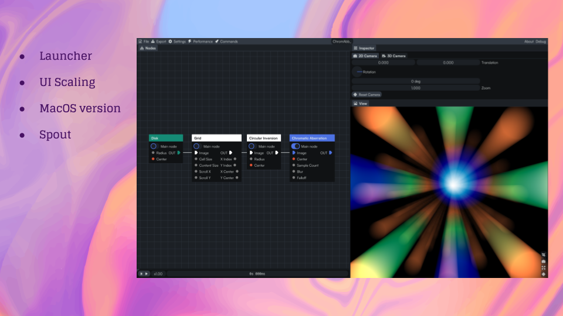
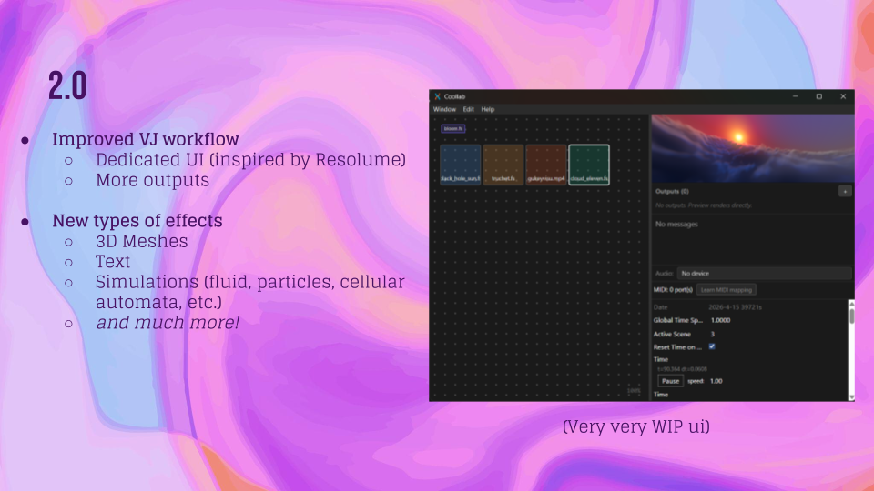

# Coollab

Coollab is a node-based software to create generative visuals in real time. It is designed to be very intuitive and easy to use, even for people who have zero notions of programming or math.

### Further Links:

https://coollab-art.com/

## Slide 0 - Title slide

There will be a workshop tomorrow if you want to learn the basics of Coollab!

## Slide 1 - Changelog

Over the last year, on top of adding many new effects and fixing bugs, we have focused a lot on improving the user experience. A few notable changes:
  - A Launcher, which automatically installs new versions and opens each project with the right version (installing it first if necessary)
  - UI scaling, allowing support for high-DPI screens
  - The MacOS version!
  - Supporting the Spout protocol (which allows texture sharing between applications with zero copies)

## Slide 2 - Roadmap

We are working on a 2.0 version with the goal to expand what the software can do:
- Improved VJ workflow:
  - Dedicated UI to switch between scenes during a live performance (inspired by Resolume)
  - More outputs (multiple windows, NDI protocol, projecting on domes and other immersive spaces, etc.)
- New types of effects (this will be a complete rewrite of our internal engine to make it much more generic). We want to lay the ground for:
  - 3D meshes
  - Text
  - Simulations (of fluid, particles, cellular automata, etc.)
  - *and much more!*

## Presence at LGM

Jules Fouchy - Maintainer
Benoît Baraille - Community manager

Talk: Wednesday 15:30 "Exploring modern UI frameworks"
Workshop: Thursday 13:40 "Making real-time generative visuals with Coollab"