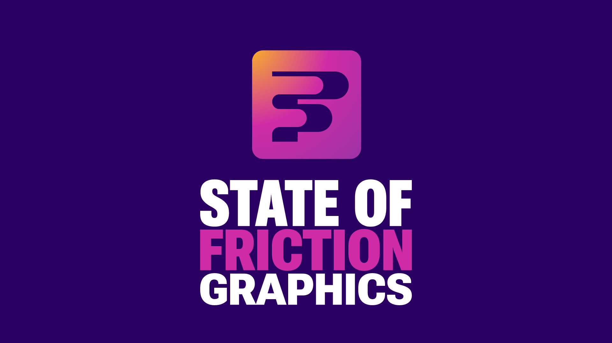
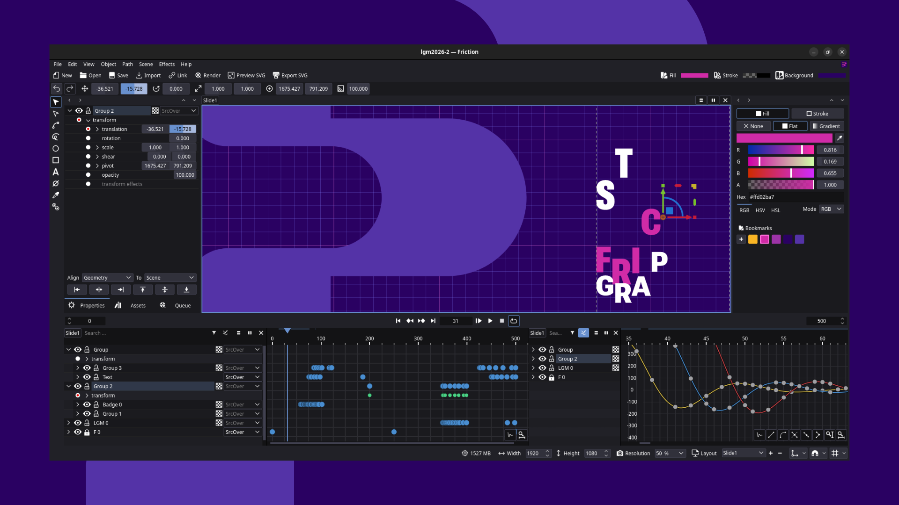
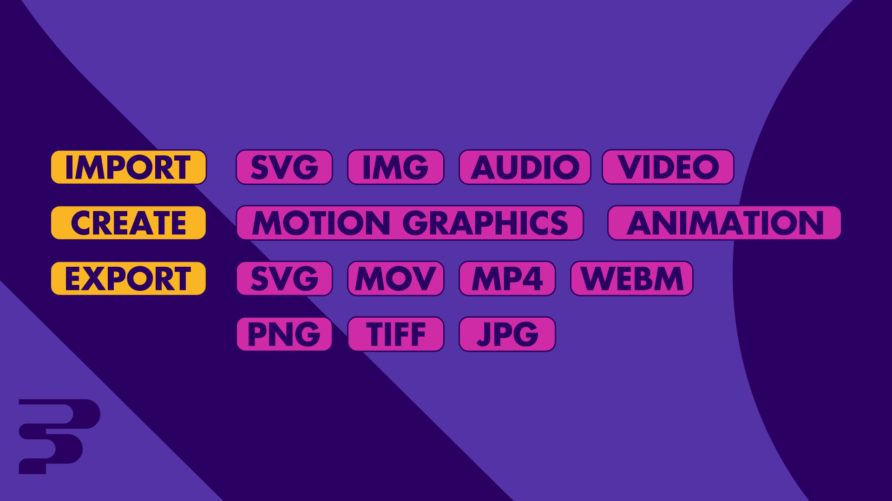
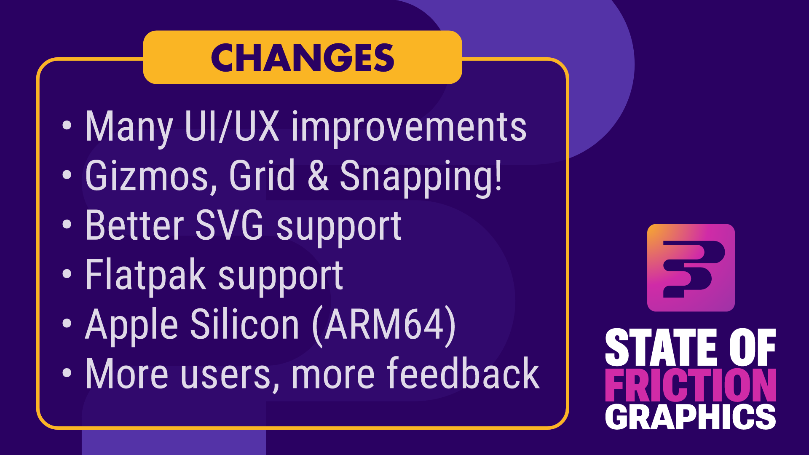
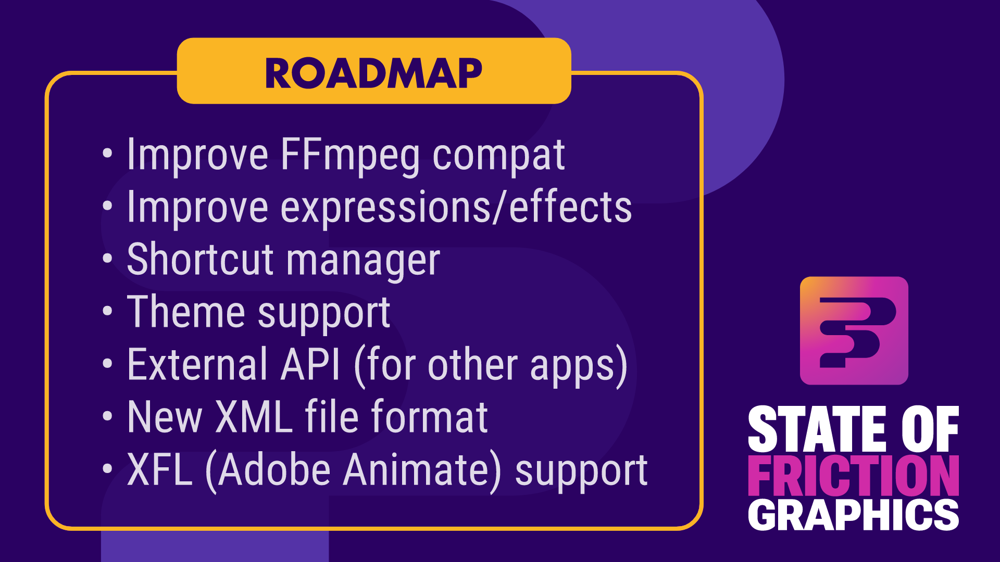
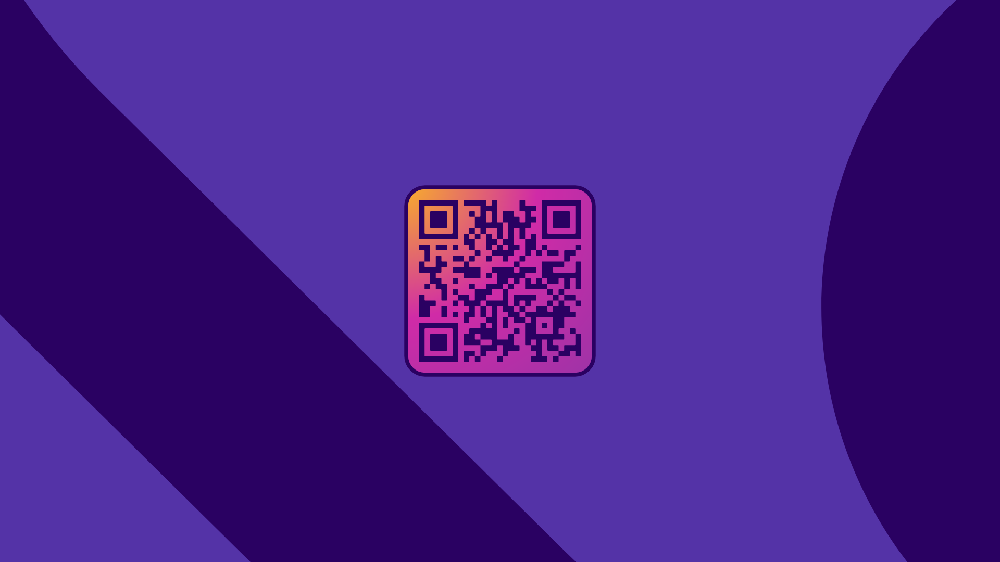

```
Slides provided in PNG and animated SVG, the SVGs should be viewed using the included HTML (open 'slides.html' and click mouse for next).

PNGs are exported frames from the original animation.

Feel free to use or change anything to fit your presentation.

Everything was created in Friction.
```

## Introduction



Friction is a vector-based motion graphics application designed to create animated elements (SVG) and video specifically for the web.



Our core stack includes:

* Skia: Powering our 2D vector/raster graphics engine with high-performance GPU acceleration
* FFmpeg: Handling audio and video processing
* Qt: Providing the foundation for the UI and application logic

The project originated as a fork of enve in 2023. Since then, our primary mission has been to stabilize the codebase, refine the UI/UX, and streamline the workflow for motion designers.

For more information visit https://friction.graphics



## Changes (since LGM 2025)



### UX Overhaul

* Significant improvements to the overall user experience and workflow
* Introduced dedicated transform interactors (gizmos) on canvas
* Added basic grid support and a snapping system

### SVG Pipeline Refactoring

* Complete rewrite of gradient, color, and opacity handling
* Full support for Mix Blend Modes and new masking options on export
* Custom SVG Optimizer: We have replaced the external SVGO application with a native SVG optimizer written from scratch. Resulting in better performance, smaller binaries, easier cross-platform deployment, and improved long-term maintainability

### Platform Support

* Official support for Flatpak was added; landing on Flathub very soon
* Added official support for ARM64: Targeting Apple Silicon (macOS) with Linux in testing

### Community Growth

We’ve seen a steady influx of new users. While the feedback is invaluable, we’re currently balancing a growing list of feature requests with our development capacity.

### The Road to v1.0

While the v1.0.0 milestone has been delayed several times, the official release is now imminent. In the meantime, we recommend that all new users download our latest "developer release" to access the most up-to-date fixes.

## Roadmap



We are targeting a v1.1 release by late 2026 or early 2027. With several betas and release candidates through this year.

### FFmpeg v6+ support

Major compatibility update from v4 already completed; entering public testing immediately following the v1.0 release.

### Refactoring Tech Debt

Overhauling expressions and effects to resolve legacy constraints and improve performance and stability.

### Shortcut Manager

Implementing a fully remappable keybinding system.

### Theme Engine

Introducing a dedicated "Light Mode" and user-sharable themes. Development is already underway and slated for the first v1.1 betas.

### Scriptable API

Opening Friction to users and external applications. We aim to collaborate with other libre graphics projects to establish common workflows.

### New (Open) Project File Format

Transitioning from a limited binary format to a transparent XML-in-ZIP structure.

Timeline: v1.1 (Introduction) → v1.2 (Deprecation of binary format) → v1.3 (Removal of binary format)

### XFL Support

Experimental support for the Adobe Animate (XFL) format is planned for v1.1.

---

Optional end slide with QR link to downloads.


