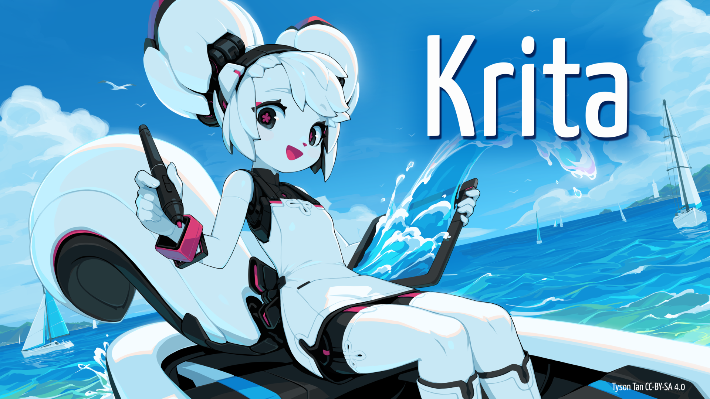
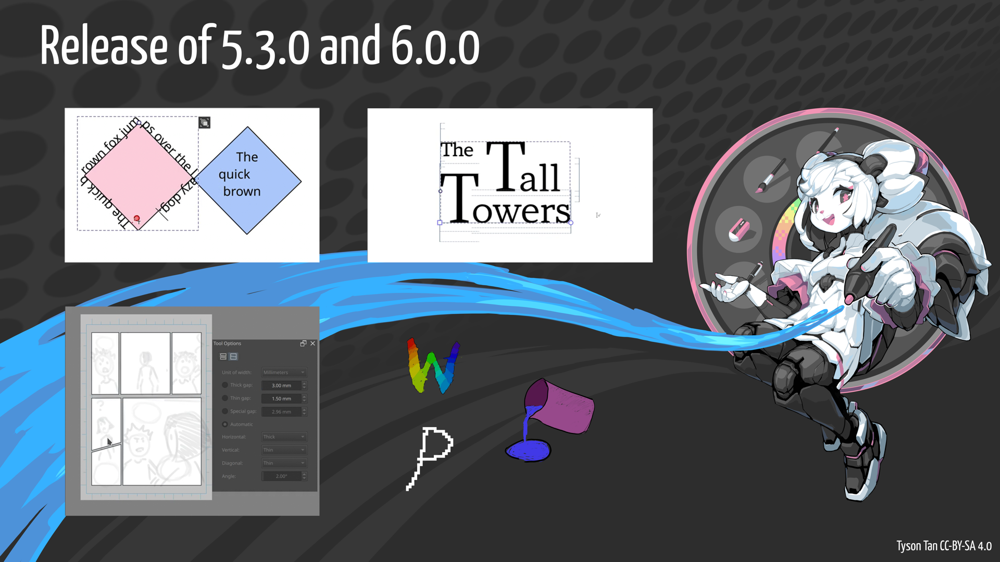
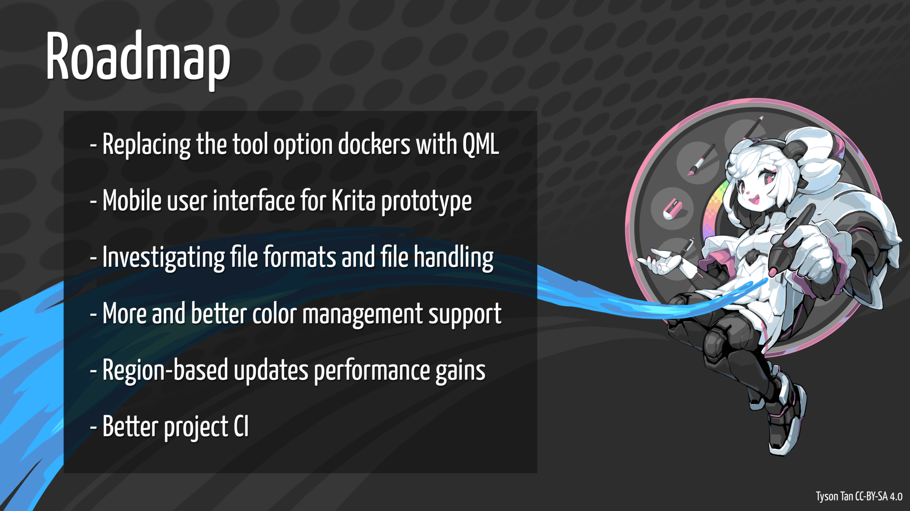

# Krita

Krita is a professional FREE and open source painting program. It is made by artists that want to see affordable art tools for everyone.

### Further Links:
https://krita.org/en/

## Slide 0 - title slide

Krita is a professional FREE and open source painting program. It is made by artists that want to see affordable art tools for everyone. This year Krita has been busy refactoring code and bringing new features to users.

## Slide 1 - Changelog

Krita did a recent simultaneous release of Krita 5.3.0 and Krita 6.0.0! Both versions are almost functionally identical, with 6.0.0 having more Wayland functionality but also being more unstable as it's based on Qt 6.

- Krita 6 comes with color management and support for 10 bit displays and fractional scaling
- The text tool received a full overhal. Text can now be edtied directly on the canvas as well as IME support
- Text can also be wrapped, inside areas or following shapes, fully conforming to SVG2
- New options for text including a text properties docker and glyph palette
-  On canvas Type Setting Mode allowing for editing font size, baseline shift, line height, and dominant baselone directly on canvas.

- A new comic panel editing tool which allows making panel layouts easily
- pixel smoothing
- selection toolbar
- fill tool getting a close gaps functionality
- improvements to various filters and layers, as well as improvements to dockers

## Slide 2 - Roadmap

- The project is working on replacing the tool option dockers with QML
- Hacking away at a protoype for a mobile user interface for Krita
- Investigating file formats and file handling
- More and better color management support
- region-based updates performance gains
- Better project CI

The images on these slides for Krita are based off to Tyson Tan's work licensed under Creative Commons Attribution-ShareAlike 4.0

## Presence at LGM
Tiar
Carsten (askmeaboutloom)
