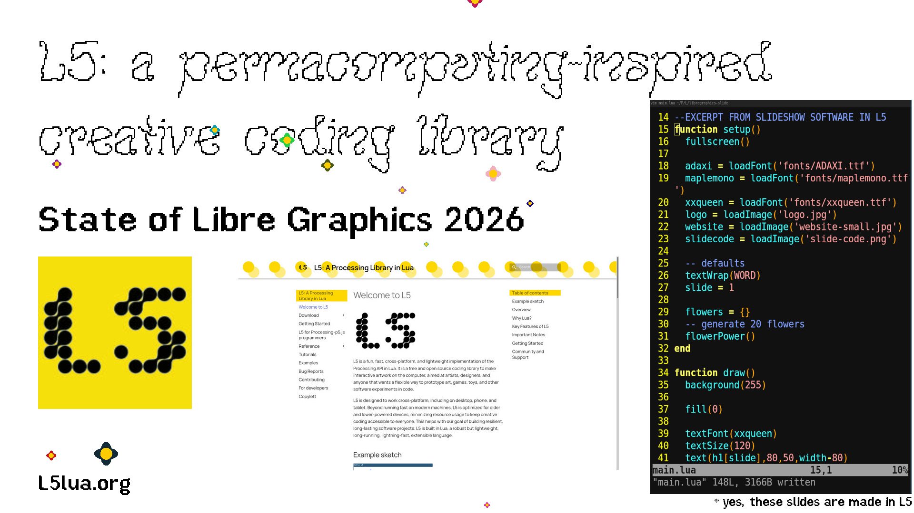
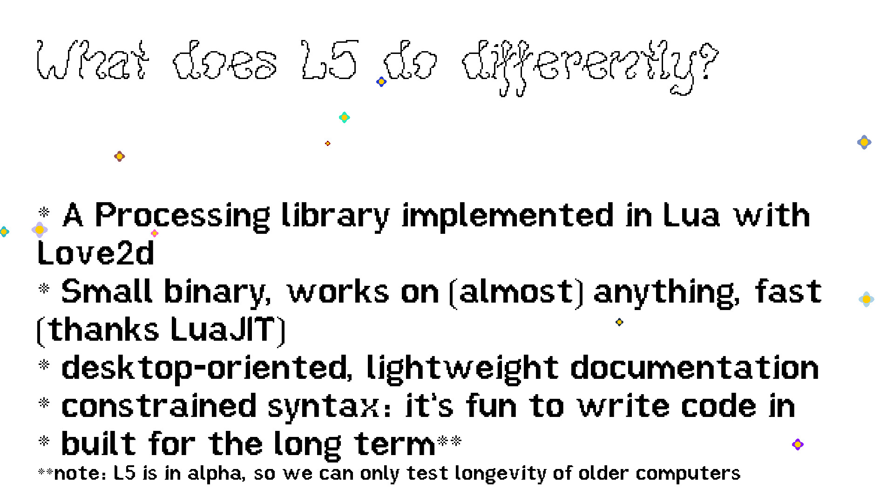

# L5

L5 is an LGPL-licensed fun, fast, cross-platform, and lightweight implementation of Processing in Lua, built with LÖVE, and designed with principles of permacomputing. Beyond running fast on modern machines, L5 is optimized for older and lower-powered devices, minimizing resource usage to keep creative coding accessible to everyone. Our alpha has been out since December and we continue to build out functionality, documentation, and expand the community.

### Further Links:

https://l5lua.org

## Slide 1 - Presenting L5

L5 is a new Processing/p5 creative coding library independently initiated, implemented in Lua with the LÖVE framework. It is designed with permacomputing principles - to be lightweight, work on the widest variety of machines, stay true to the Processing approach, balanced with constraints to support running on resource-constrained machines.

## Slide 2 - What does L5 do differently?

In the past several months we've taught a variety of workshops, had over a dozen folks contribute to the library, and we continue to build out functionality and debug. Next steps will be to expand and refine installation documentation, and build out sound and camera libraries! We're eager to help get the library to more users and expand the community of new contributors.

L5lua.org

Thanks Lee!
