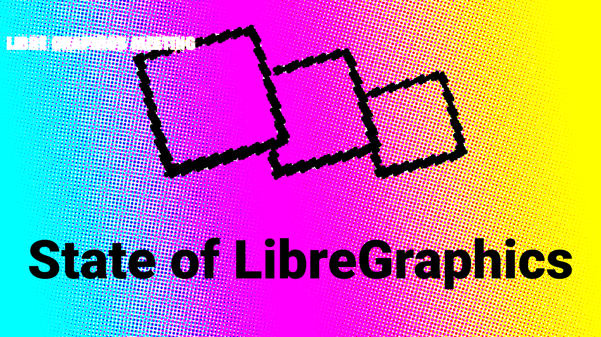

<!-- 
└── project name folder/
    ├── project.md
    │   ├── # Name
    │   ├── Description of Project
    │   ├── ### Further Links
    │   ├── ## Slide 0 - title slide
    │   │   └── Slide 0 speaker notes
    │   ├── ## Slide 1 - Changelog
    │   │   └── Slide 1 speaker notes
    │   ├── ## Slide 2 - Roadmap/Future
    │   │   └── Slide 2 speaker notes
    │   └── ## Presence at LGM
    ├── Slide 0.png
    ├── Slide 1.jpg
    ├── Slide 2.png
    └── logo.svg 
-->

# Sample Project

Sample project is a demonstration to give an example of how projects can be submitted for the State of Libre Graphics 2026.

### Further Links:
https://libregraphicsmeeting.org

## Slide 0 - title slide

Every year, the [Libre Graphics Meeting](https://libregraphicsmeeting.org) starts with an opening presentation called the **State of Libre Graphics**, an update from the many software, curation publication and umbrella projects of our Libre Graphics community. To help, we made a the SampleProject! So let's see what SampleTeam has been up to this year!

## Slide 1 - Changelog

