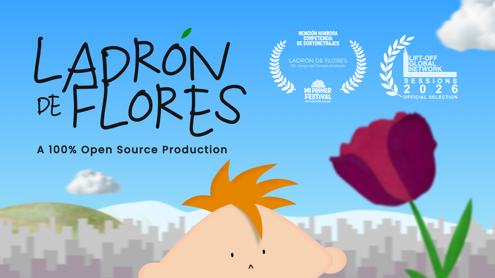
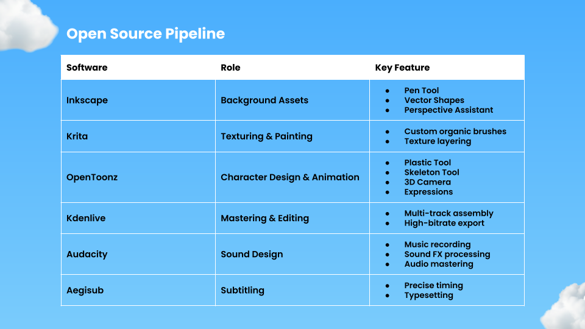
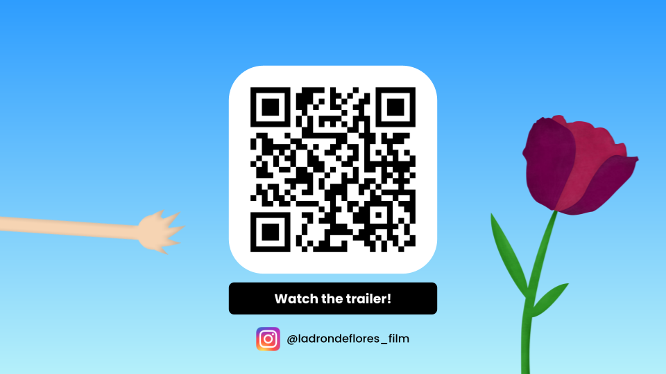

# Ladrón de Flores

---

## Slide 0

Ladrón de Flores (Flowers Thief) is an independent short film and production pipeline project recognized at various festivals, created to validate a 100% Libre Graphics workflow for cinematic animation.

Mission: To demonstrate that open-source tools can handle complex, professional 2D animation from concept to final master.

### Further links

- Website: <https://jdca.cl>
- Trailer: <https://youtu.be/6BaC043mvU0>
- Production Blog: <https://jdca.cl>

---

## Slide 1 - Production Pipeline

Speakers Notes:

This project represents a full-stack production case study using Inkscape, Krita, OpenToonz, Kdenlive, Audacity, and Aegisub.

The core of the animation was built in OpenToonz, where we pushed the software beyond traditional cel-animation. We utilized its Plastic and Skeleton tools for advanced cutout rigging, its 3D Camera for cinematic depth, and custom expressions to automate expressive movements. Meanwhile, Inkscape and Krita were responsible for modeling the entire graphic world where the story takes place.

---

## Slide 2 - Showcase & Training

Speakers Notes:

[Watch the Ladrón de Flores Production Reel](https://youtu.be/6BaC043mvU0)

To date, the film has earned multiple international festival laurels. 

Our roadmap for 2026 focuses on documenting this pipeline to provide professional training, helping artists transition from proprietary suites to the Libre Graphics ecosystem through high-end production methodologies.